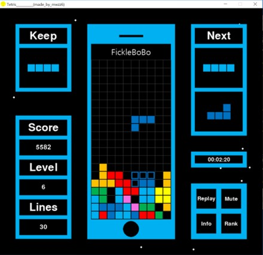

<span style="font-size:500%">

# 📝 프로필

✔ 이름

    육민우

✔ 나이  

    만 26살(97년생)

✔ 거주지

    노량진(지하철 20분, 도보 15분)

✔ MBTI

    ISFJ(F 95% 이상)

✔ 혈액형

    A

✔ 주량

    소주 0.5 ~ 1.5병

✔ 음악

    힙합, 여자 아이돌, 기타 한국 노래

✔ 운동

    🏊‍♀️수영
    🚲따릉이
    🏓탁구

--------------------------------------------------

# 🧐 성격

✔ 화가 잘 나지 않는 온화한 편

✔ 장난치는 것을 아주 좋아함

✔ 부탁하는 것을 어려워 함

✔ 계획적으로 살려고 노력하지만 게으름

✔ 혼자 관찰하거나 분석하는거 좋아함

✔ 감정 표현을 잘 못함

✔ 삘 받으면 맘대로 함

--------------------------------------------------

# ⛏ 전공 - 건설환경공학부(토목심화트랙)
건설경제학

    경제 공부가 돈벌이 뿐만 아니라 역사, 산업을 이해하는데 중요하다는 것을 느낌

물순환플랜트공학

    "검색하면 나오는 걸 암기하는데 시간낭비를 하지마라"

--------------------------------------------------

# 💻 개발 경험(2년 전)


✔ 열혈 C

✔ 열혈 자료구조


✔ Do it! 점프 투 파이썬

✔ Do it! 자료구조와 함께 배우는 알고리즘 입문

✔ 나도코딩 유튜브 프로젝트 클론코딩

✔ 토이프로젝트로 테트리스 구현


--------------------------------------------------

# 🙄 TMI
## 😮

- 서울에 대한 로망이 있음 -> 노량진으로 그냥 이사 옮
- 비트코인하다가 물려서 힘듦
- 유튜브 항상 2배속으로 봄

## 😄

- 싸밥은 주로 B 먹음
- 배라가면 체리쥬빌레 항상 담음(민초 안먹음)
- 다이노탱, 메타몽, 고양이(랙돌) 좋아함
- 사주 좋아함(타로X)
- 향수 시향 다니는거 좋아하고 모으는 것도 좋아함
- 청소, 빨래, 설거지 몰아서 하는거 좋아함
- 지식 유튜브 보는거 좋아함
- 지하철타는 거 좋아하는데 1호선은 싫어함

## 😅

- 버섯, 가지, 브로콜리, 선지 안먹음
- 젓가락질 꼰대
- 디자인 똥손

--------------------------------------------------

# 💪 SSAFY 목표
0. 깃 마스터 하기
1. 자바의 정석
2. 클린 코드
3. 생각하는 프로그래밍
4. 헤드 퍼스트 디자인 패턴
5. 이펙티브 자바
```
이번 주 로봇퀘스트부터 쉽지 않아서 앞으로 정말 더 열심히 해야겠다고 다짐했으며, 제가 선택한 길인만큼 하루하루 겸손하게 열심히 공부하자

최종 목표 : 프리랜서
```
